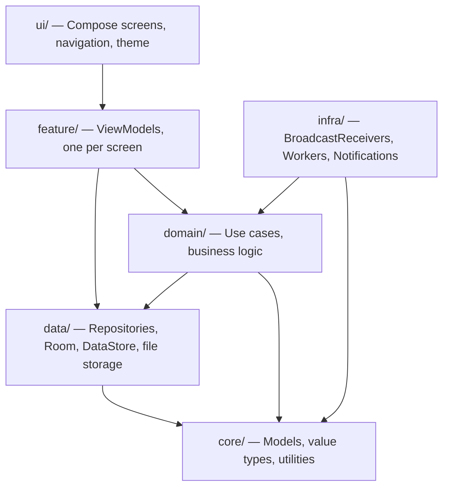

# Open Source Body Tracker — Developer Documentation

A privacy-focused Android app for tracking body measurements, computing derived body composition metrics, and visualizing progress over time. All data is stored locally on the device — no accounts, no cloud sync.

---

## Glossary

| Term | Definition |
|------|-----------|
| **Body measurement entry** | A single recording containing a date, optional numeric metrics (weight, circumferences, skinfolds), an optional photo, and an optional text note. Stored as a Room entity. |
| **Measured metric** | A raw value the user enters directly: weight, body fat %, or one of 5 circumferences / 5 skinfold measurements. Defined in `MeasuredBodyMetric` enum. |
| **Derived metric** | A value computed at runtime from measured metrics and the user profile: BMI, Navy BF%, Skinfold BF%, WHR, WHtR. Never stored. Defined in `DerivedBodyMetric` enum. |
| **Analysis method** | An enabled/disabled toggle for one derived metric calculation. Enabling a method auto-requires its dependent measured metrics. See `AnalysisMethod` enum. |
| **User profile** | Sex, date of birth, and height. Required for derived metric calculations. Stored in DataStore. |
| **Metric registry** | The ordered catalog of all body metrics (measured + derived). Defined in `core/model/MetricRegistry.kt`. Controls display order across all screens. |
| **Measurement settings** | Configuration controlling which analysis methods are active and which measurements are collected. Stored in DataStore. |
| **Measurement visibility** | Per-metric toggles for whether a metric appears in charts, tables, or both. Independent of collection settings. |
| **Export archive** | A password-protected ZIP file containing `measurements.csv`, `profile.json`, `metadata.json`, and photos. See [EXPORT.md](EXPORT.md). |
| **Onboarding** | First-launch flow: welcome screen offering Create Profile, Try Demo Data, or Import Backup. Followed by profile, analysis, and reminder setup steps. |
| **Demo mode** | A mode seeded with realistic fake data so users can explore the app before entering real measurements. A banner is shown; resetting clears all data. |

---

## Architecture

Single-module Android app: Kotlin + Jetpack Compose + MVVM + Hilt + Room + DataStore.

Full details: [ARCHITECTURE.md](ARCHITECTURE.md)

---

## Features

### Measurements

The Measurements tab (`measurements`) is the app's home screen. It displays:

- **Latest Measurement Card** — most recent entry's values in a 2-column grid, including derived metrics. Respects measurement visibility settings.
- **Measurement Table** — scrollable table of recent entries (latest 5, expandable to full list via `measurements/all`). Missing values shown as `--`.
- **FAB** — opens `measurements/add` to record a new entry.

Each entry records a date, up to 11 optional numeric metrics, an optional photo, and an optional note. Saving requires at least one numeric metric, photo, or note (`MeasurementSaveValidator`).

Key code: `feature/measurements/`, `domain/measurements/`, `data/measurements/`

### Analysis

The Analysis tab (`analysis`) renders line charts (Vico) for each visible metric over a selectable time window.

- **Duration selector**: 1M, 3M (default), 6M, 1Y, All
- **Chart cards**: one per visible metric from the metric registry, filtered by visibility and analysis method settings
- Derived metrics are calculated on the fly via `CalculateAndRateDerivedMetricsUseCase`

Formulas: [FORMULAS.md](FORMULAS.md) — Health ratings: [HEALTH_RATINGS.md](HEALTH_RATINGS.md)

Key code: `feature/analysis/`, `domain/metrics/`

### Photos

The Photos tab (`photos`) displays a gallery of measurement photos grouped by date.

- **Storage**: Internal app-private directory (`measurement_photos/`). Never visible in system gallery.
- **Capture**: Camera FAB on the measurement edit screen. Photo is persisted only on save. Compressed according to photo quality setting.
- **Compare mode** (`photos/compare/{left}/{right}`): Side-by-side slider comparison of exactly 2 selected photos.
- **Animate mode** (`photos/animate/{ids}`): Sequential playback of 2+ selected photos to visualize progress.
- **Delete**: Photo is deleted when its measurement is deleted.

Key code: `feature/photos/`, `data/photos/InternalPhotoStorage.kt`, `data/photos/PhotoCompressor.kt`

### Settings

A unified settings hub (`settings`) with sub-screens for all configuration. Covers analysis method toggles, measurement collection, visibility, profile, reminders, export, and miscellaneous options.

Full details: [SETTINGS.md](SETTINGS.md)

### Export & Import

Password-protected ZIP export with automatic nightly scheduling. Import available during onboarding to restore from backup.

Full details: [EXPORT.md](EXPORT.md)

### Reminders

Configurable measurement reminders using Android's AlarmManager.

- **Scheduling**: Inexact one-shot alarms. Only the next reminder is scheduled; after it fires, the next matching weekday/time is computed and scheduled.
- **Configuration**: Enable toggle, weekday selection (filter chips), time picker. At least one weekday required when enabled.
- **Notification**: Tapping opens the Add Measurement screen.
- **Re-sync**: Alarms are re-synced on settings save, device reboot, and timezone changes (via `ReminderRescheduleReceiver`).
- **Permission**: On Android 13+, notification permission is requested when the user saves enabled reminders.
- **Cancellation**: Disabling reminders cancels all scheduled alarms.

Key code: `domain/reminders/ReminderAlarmScheduler.kt`, `infra/notifications/`, `feature/settings/reminders/`

### Onboarding

First-launch flow (start destination when `GeneralSettings.onboardingCompleted` is false):

1. **Welcome screen** (`onboarding/start`) — three options:
   - **Create Profile** → proceeds to step 2
   - **Try Demo Data** → seeds realistic fake data, skips to `measurements`
   - **Import Backup** → opens `onboarding/import` to restore a ZIP archive
2. **Profile** (`onboarding/profile`) — Sex, date of birth, height
3. **Analysis & Measurements** (`onboarding/analysis`) — Select analysis methods and measurement toggles
4. **Reminders** (`onboarding/reminders`) — Configure reminder schedule

On completion, navigates to `measurements` and removes the onboarding graph from the back stack.

Key code: `feature/settings/onboarding/`, `feature/importbackup/`

---

## Navigation

Full route map and navigation graph: [NAVIGATION.md](NAVIGATION.md)

---

## Document Map

| Document | Content |
|----------|---------|
| [INDEX.md](INDEX.md) | This file — project overview, glossary, feature summaries |
| [AGENTS.md](AGENTS.md) | AI agent handoff — tech stack, build commands, working rules |
| [ARCHITECTURE.md](ARCHITECTURE.md) | Package layout, layer responsibilities, design trade-offs |
| [NAVIGATION.md](NAVIGATION.md) | Route map, scaffolds, overflow menu, back behavior |
| [FORMULAS.md](FORMULAS.md) | Derived metric formulas (BMI, Navy, Skinfold, WHR, WHtR) |
| [HEALTH_RATINGS.md](HEALTH_RATINGS.md) | Health rating thresholds and severity levels |
| [SETTINGS.md](SETTINGS.md) | Settings hub, analysis methods, measurement dependencies, visibility |
| [EXPORT.md](EXPORT.md) | Export archive format, encryption, auto-export, import flow |
| [TRANSLATIONS.md](TRANSLATIONS.md) | String resource rules for multi-locale sync |
| [plans/](plans/) | Feature concepts and requirements for upcoming/recent features |
| [archive/](archive/) | Original feature specification documents (historical reference) |
