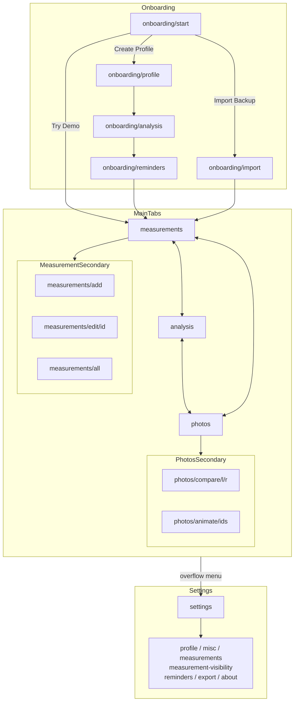

# Navigation

## Scaffolds

The app uses two scaffold types:

- **`MainScreenScaffold`** — Used by the three main tabs. Provides a top app bar (dynamic title, overflow menu), and a bottom navigation bar.
- **`SecondaryScreenScaffold`** — Used by all other screens. Provides a top app bar with a back arrow and title. No bottom navigation.

During onboarding, some screens (Profile, Analysis, Reminders) reuse their settings-mode composable but hide the back button; navigation is driven by the onboarding flow instead.

## Overflow Menu

The overflow menu on main tab screens contains:

| Entry | Route |
|-------|-------|
| Settings | `settings` |
| About | `settings/about` |

In debug builds, additional entries appear: Trigger Reminder, Reset App, Fake Data Generator, Schedule Export.

## Bottom Navigation

| Tab | Icon | Route |
|-----|------|-------|
| Measurements | MonitorWeight | `measurements` |
| Analysis | SsidChart | `analysis` |
| Photos | CameraAlt | `photos` |

Tab selection uses `launchSingleTop = true`.

## Route Map

### Onboarding (nested graph: `onboarding`)

| Route | Screen | Next |
|-------|--------|------|
| `onboarding/start` | Welcome — Create Profile, Try Demo Data, Import Backup | Profile or Demo or Import |
| `onboarding/profile` | Profile form (Sex, DOB, Height) | `onboarding/analysis` |
| `onboarding/analysis` | Analysis method + measurement toggles | `onboarding/reminders` |
| `onboarding/reminders` | Reminder schedule setup | Completes onboarding -> `measurements` |
| `onboarding/import` | Import encrypted backup ZIP | Completes onboarding -> `measurements` |

On completion (demo, import, or full flow), navigates to `measurements` and removes the onboarding graph from the back stack.

### Main Tabs

| Route | Scaffold |
|-------|----------|
| `measurements` | MainScreenScaffold |
| `analysis` | MainScreenScaffold |
| `photos` | MainScreenScaffold |

### Measurement Sub-Routes

| Route | Screen |
|-------|--------|
| `measurements/all` | Full measurement table |
| `measurements/add` | Add new measurement |
| `measurements/edit/{measurementId}` | Edit existing measurement |

### Photo Sub-Routes

| Route | Screen |
|-------|--------|
| `photos/compare/{leftMeasurementId}/{rightMeasurementId}` | Side-by-side comparison with slider |
| `photos/animate/{ids}` | Sequential playback of selected photos |

### Settings Sub-Routes

| Route | Screen |
|-------|--------|
| `settings` | Settings hub (navigation list) |
| `settings/profile` | Profile editor |
| `settings/misc` | Unit system, photo quality |
| `settings/measurements` | Analysis method + measurement toggles |
| `settings/measurement-visibility` | Show/hide metrics in charts and tables |
| `settings/reminders` | Reminder schedule |
| `settings/export` | Export configuration and manual export |
| `settings/about` | App info, links |

### Debug (debug builds only)

| Route | Screen |
|-------|--------|
| `debug/fake-data-generator` | Seed fake measurement data |

## Start Destination

Determined by `GeneralSettings.onboardingCompleted`:
- `false` -> `onboarding` (the nested graph, starting at `onboarding/start`)
- `true` -> `measurements`

## Deep Link: Notification -> Add Measurement

Tapping a reminder notification triggers the measurement-add deep link handler. If onboarding is incomplete, the request is ignored. Otherwise, the app navigates to `measurements` then `measurements/add`.

## Back Behavior

- Main tabs are top-level; bottom nav switches between them.
- All sub-routes (measurement add/edit/all, photo compare/animate, settings/*) push onto the stack and pop on back.
- Onboarding steps are sequential; completing the final step replaces the entire onboarding graph.

## Navigation Graph

## Key Source Files

- `ui/navigation/Routes.kt` — All route string constants
- `ui/navigation/BodyTrackerNavHost.kt` — NavHost wiring
- `ui/navigation/MainDestination.kt` — Tab enum (routes, icons, titles)
- `ui/components/MainScreenScaffold.kt` — Tab scaffold with overflow menu
- `ui/components/SecondaryScreenScaffold.kt` — Sub-screen scaffold with back arrow
- `feature/settings/onboarding/OnboardingNavGraph.kt` — Onboarding nested graph
