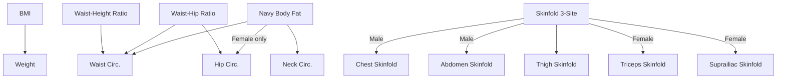

# Settings

## Settings Hub

The settings screen (`settings`) is a navigation hub. Each entry opens a dedicated sub-screen.

| Entry | Route | Purpose |
|-------|-------|---------|
| Profile | `settings/profile` | Sex, date of birth, height |
| Miscellaneous | `settings/misc` | Unit system, photo quality |
| Measurements & Analysis | `settings/measurements` | Analysis method toggles + measurement collection toggles |
| Measurement Visibility | `settings/measurement-visibility` | Show/hide metrics in charts and tables |
| Reminders | `settings/reminders` | Reminder schedule |
| Export | `settings/export` | Backup configuration, manual export |
| About | `settings/about` | App info, GitHub link, contact email |

All settings screens use `SecondaryScreenScaffold` (back arrow + title). During onboarding, Profile, Measurements & Analysis, and Reminders screens are reused with the back button hidden.

---

## Analysis Methods

Five analysis methods can be independently enabled or disabled:

| Method | Enum value |
|--------|-----------|
| BMI | `Bmi` |
| Navy Body Fat % | `NavyBodyFat` |
| Skinfold Body Fat % (3-site) | `Skinfold3SiteBodyFat` |
| Waist-Hip Ratio | `WaistHipRatio` |
| Waist-Height Ratio | `WaistHeightRatio` |

Enabling a method auto-requires its dependent measurements. Required measurements are locked on and cannot be disabled.

---

## Measurement Dependencies

Full dependency table:

| Analysis Method | Required Measurements | Sex-specific |
|----------------|----------------------|-------------|
| BMI | Weight | No |
| Navy Body Fat | Neck, Waist | + Hip for Female |
| Skinfold 3-Site | Thigh Skinfold | + Chest & Abdomen Skinfold (Male), + Triceps & Suprailiac Skinfold (Female) |
| Waist-Hip Ratio | Waist, Hip | No |
| Waist-Height Ratio | Waist | No |

When the user changes their sex on the profile screen, measurements needed for currently enabled analysis methods are auto-enabled (additive only — nothing is disabled).

---

## Measurement Collection

All 11 measured body metrics can be toggled on or off:

**Circumferences (cm):** Neck, Chest, Waist, Abdomen, Hip

**Skinfolds (mm):** Chest, Abdomen, Thigh, Triceps, Suprailiac

Measurements required by an enabled analysis method are locked on and visually marked as required. Optional measurements can be freely toggled.

Disabled measurements do not appear on the Add/Edit Measurement screen.

---

## Measurement Visibility

Controls which metrics appear in:
- Analysis screen (charts)
- Measurement tables (latest card, all-measurements table)

Each metric has independent visibility for analysis and table views. Derived metrics from disabled analysis methods are automatically hidden. Visibility does not affect data collection.

---

## Profile

Fields: Sex (Male/Female segmented button), Date of Birth, Height (cm or ft/in based on unit system).

---

## Miscellaneous

**Unit System** — Segmented button: Metric (kg, cm) or Imperial (lbs, in). Affects display only; storage is always metric.

**Photo Quality** — Controls resolution and JPEG compression at save time:

| Level | Max dimension | JPEG quality |
|-------|-------------|-------------|
| Original | As captured | No compression |
| High | 2560 px | 90% |
| Medium | 1920 px | 80% |
| Low | 1280 px | 70% |

Default is Original. Existing photos are not retroactively reprocessed.

---

## Reminders

See the Reminders section in [INDEX.md](INDEX.md) for scheduling behavior.

Settings: enabled toggle, weekday selection (at least one required when enabled), time picker.

---

## Export

See [EXPORT.md](EXPORT.md) for archive format and import flow.

Settings: password, device storage toggle, folder selection, manual export button.

---

## Key Source Files

- `feature/settings/SettingsScreen.kt` — Hub screen
- `core/model/MeasurementSettings.kt` — Settings data model
- `domain/metrics/DerivedMetricsDependencyResolver.kt` — Dependency resolution logic
- `core/model/PhotoQuality.kt` — Photo quality levels
- `data/settings/MeasurementSettingsRepository.kt` — Settings persistence
